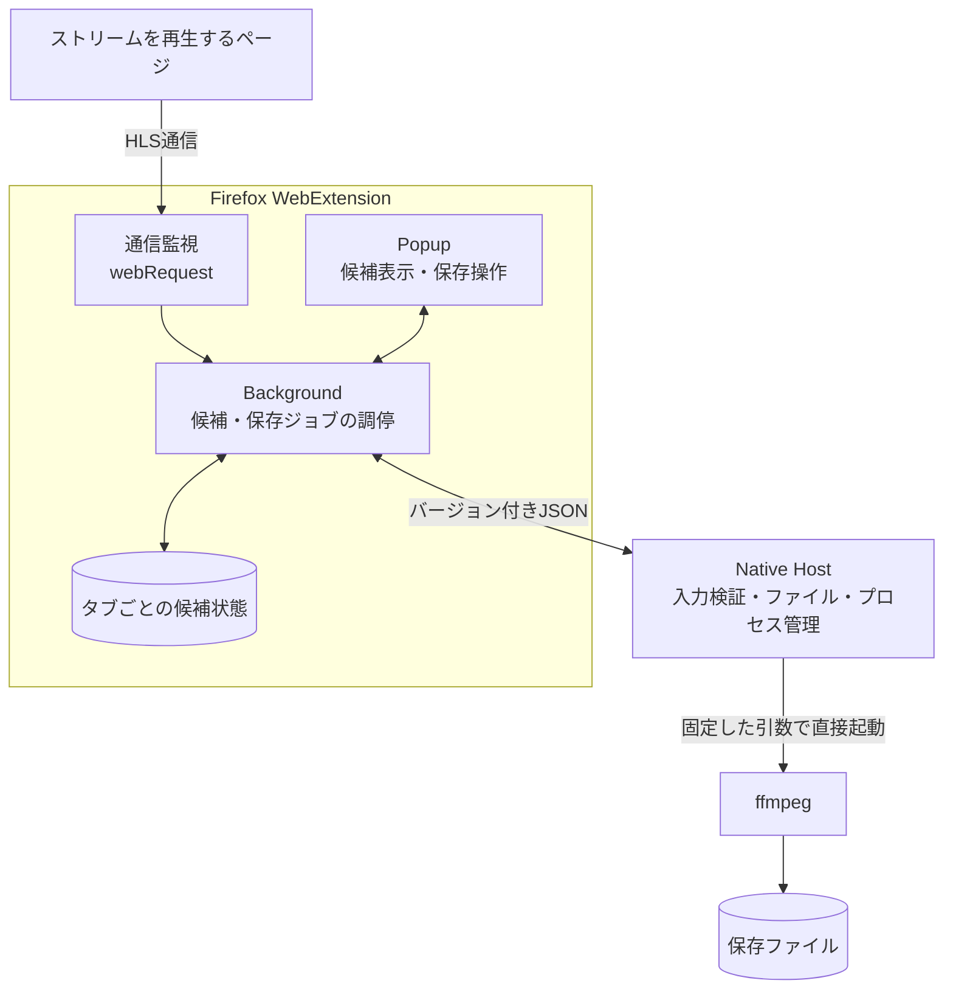

# 基本設計

## 位置付け

この文書は、Media Stream Bridge の初期実装で維持するコンポーネント境界と責務を示す。プロダクトの目的と対象範囲は [`README.md`](../../README.md) を正本とし、画面の詳細、内部のクラス構成、未検証の処理手順はここでは固定しない。

設計は実装前の仮説である。実装と検証で新しい制約が判明した場合は、外部契約と安全性を維持した上で見直す。

## 基本構成

Firefox WebExtension と Native Host の間を、ブラウザの権限領域とローカル環境の権限領域を分ける信頼境界とする。

## コンポーネントの責務

### Firefox WebExtension

#### 通信監視

- `webRequest` で閲覧中のタブが行う通信を観測する。
- 初期版で対象とする HLS の URL を候補として収集する。
- 候補を発生元のタブと関連付ける。
- 同じタブでトップレベルのページ遷移がコミットされた場合は、前のページで検出した候補を破棄する。
- 通信を変更または遮断しない。

#### Background

- タブごとのストリーム候補を管理する。
- Popup からの照会と保存操作を受け付ける。
- Native Messaging の接続を所有する。
- Native Host から受け取った開始・終了状態を保存ジョブとして管理し、Popup の照会へ状態と結果を返す。

初期版は Firefox の Manifest V2 による永続 Background を使用する。Popup の生存期間に保存処理を依存させない。将来 Manifest V3 へ移行する場合は、Background の停止と Native Messaging の再接続を前提としてジョブ管理を再検討する。

#### Popup

- 現在のタブで検出した候補を表示する。
- 候補が一つに特定できる場合は自動選択し、複数ある場合は利用者に選択を求める。
- 固定した初期設定で保存を開始する。
- 保存中、完了、失敗、キャンセルの状態と結果を表示する。

Popup は候補や保存ジョブの所有者にならない。

### Native Host

- Firefox WebExtension から受け取ったメッセージを検証する。
- 保存先、ファイル名、同名ファイル、途中ファイルを管理する。
- 許可した操作に対応する固定の引数で ffmpeg を直接起動する。
- ffmpeg の終了状態を監視し、完了、失敗、キャンセルを管理する。
- Firefox WebExtension へ構造化した結果を返す。

シェルを介したコマンド実行と、Firefox WebExtension からの任意のコマンド、ffmpeg 引数、絶対保存パスの指定は許可しない。

### ffmpeg

- Native Host から指定されたストリームを取得してローカルファイルへ保存する。
- 保存ジョブの方針や Firefox との通信は持たない。

## 保存ジョブの生存期間

開始済みの保存ジョブは Native Host が所有する。UIやタブの終了を暗黙のキャンセルとして扱わない。

| 状況 | 初期版の動作 |
| --- | --- |
| Popupを閉じる | 保存を継続する |
| 発生元のタブを閉じる | 開始済みの保存を継続する |
| 利用者がキャンセルする | 対象のffmpegを終了する |
| Firefoxを終了する | Native Hostと対象のffmpegを終了する |
| 拡張機能を無効化または再読み込みする | Native Hostと対象のffmpegを終了する |
| Native Hostが異常終了する | 保存失敗として扱い、管理されないffmpegを残さない |

Firefox終了後の保存継続、Firefox再起動後のジョブ復元、保存の再開は初期範囲外とする。

## 境界を越える契約

Firefox WebExtension と Native Host は、バージョンを持つ型付きJSONメッセージで通信する。具体的なフィールドは実装時にSchemaと契約テストを正本として定義する。

契約では少なくとも次を区別する。

- 保存開始要求
- 保存キャンセル要求
- 保存開始通知
- 完了
- キャンセル
- キャンセル拒否
- 失敗

Firefox WebExtension は、保存開始時にストリームURLを、保存キャンセル時にNative Hostが発行した保存IDを渡す。Native Host は受け取った値を信頼せず検証し、実際のファイルパスとプロセス起動を決定する。

ストリームURLは認証情報を含む可能性があるため、完全な値を永続ログへ残さない。

## OSとの境界

コンポーネント構成、JSON契約、ffmpegによる保存は特定のOSへ依存させない。OS固有の処理は Native Host の起動・配布に関わる次の箇所へ隔離する。

- Native Messaging Host の登録
- ffmpeg実行ファイルの探索と配置
- ファイルパスと使用できない文字の扱い
- 実行権限
- プロセスの終了処理
- インストール手順

初期版でサポートし、動作確認するOSはmacOSのみとする。ほかのOSへの対応では基本構成を変更せず、OS固有部分を追加する。

## 現時点で固定しないこと

- Popupの詳細なレイアウト
- 候補の並び順と表示項目
- 自動選択の具体的な判定方法
- 画質候補を解析するコンポーネント
- Native Hostの実装言語
- 設定画面の構成
- 同名ファイルと途中ファイルの具体的な命名規則

これらは最小の検証実装から得た事実を基に決める。
